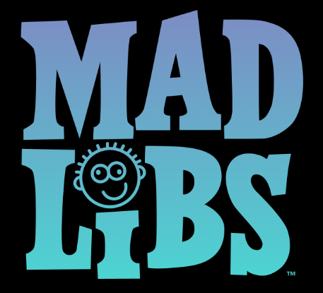

# Starter Code for DOM Programming.

Starter HTML/CSS and JS structure for in class lab to make a form for a madlibs!!

_originally forked from instructor [seanrreid](https://github.com/seanrreid/DOM-Starter-Code)_

